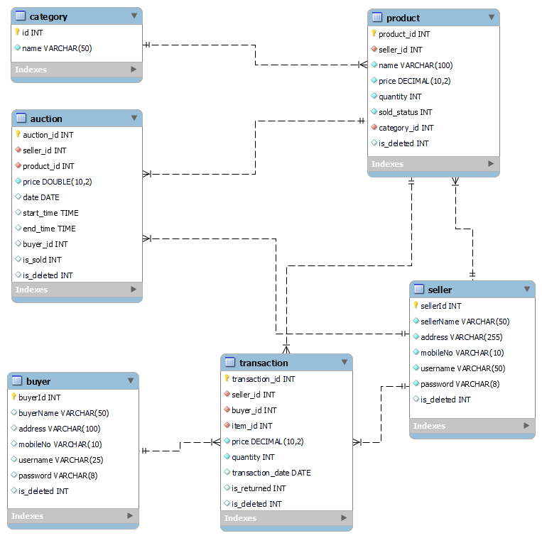

# Automated Auction system

An automated Auction System is an Application Software that is used for the buying and
selling of products. This software can be used by the auction companies who arrange
the Auction. Various buyers and sellers are registered in the Auction company.

Automated Auction system is a console based Application.

Build Automated Auction system application during the construct week at [Masai School](https://masaischool.com/). Completed the project within five days.

# Entity Relationship Diagram

# Users of the System

- Admin
- Seller
- Buyer

## 1. Admin Features

- An Admin can view the registered buyer and Seller list.
- An Admin can view all product list.
- An Admin can create an auction.
- An Admin can auction history.
- An Admin can see all items to be sold and all items already sold.
- An Admin can see items ny category.
- An Admin can view all transactions.
- An Admin can search transactions for a date range.
- An Admin can search transactions by transaction id.

## 2. Seller Features

- The seller can register himself or herself as a seller.
- The seller can update personal details.
- The seller can add new Product to sell.
- The seller can remove Product from the system.
- The seller can view the sold Product history.
- The seller can view Transaction.
- The seller can delete account.
- Login / Logout

## 3. Buyer Features

- Buyer can register himself or herself as Buyer.
- Buyer can update personal details.
- Buyer can Search and view Items by category.
- Buyer can select and view all the buyers and their Items category-wise.
- Buyer can purchase Product.
- Buyer can see Purchase History.
- Buyer can Refund Product.
- Buyer can view Transactions of self.
- Buyer can view Ongoing Auction.
- Buyer can create bid for auction.
- Buyer can also view auction history.
- Buyer can delete himself account.

## Technology used 

- Java 
- MySQL
- JDBC

## Tools used 

- Spring tool suite 
- Github
- Mysql Command Prompt
- Mysql workbench

## 👉 [Click here](https://drive.google.com/file/d/1fOWauFL-Lz-lg_2zFfmf4uI4fONW_EAL/view?usp=share_link) to go through a detailed explanation of this application.
